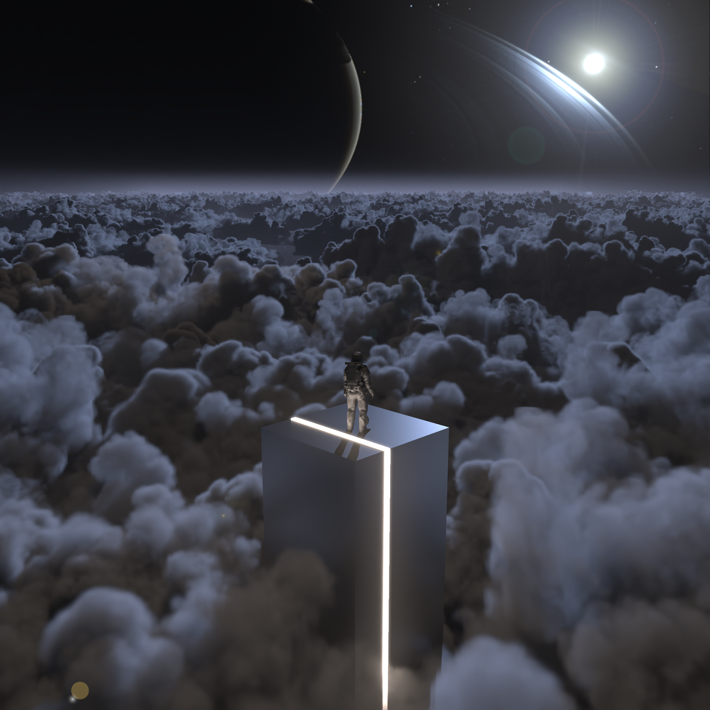
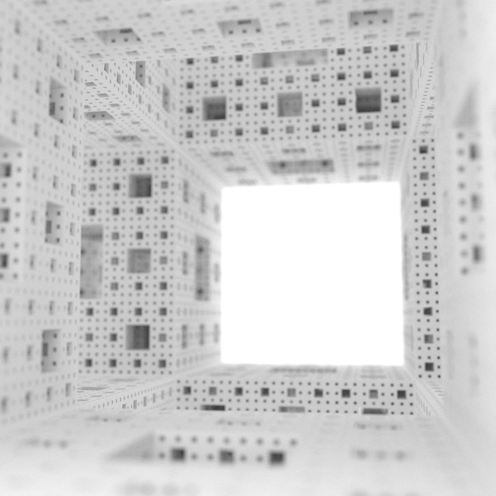
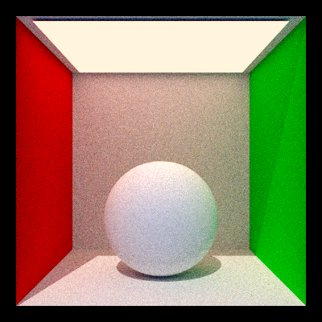
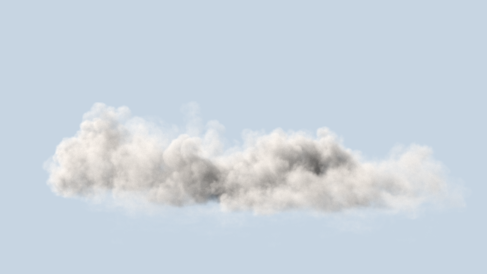

# Zeus Pathtracing Render Engine

A full fledged render engine written in C++, based on the Lightwave render engine but most of the code outside of basic project structure is written by me.

Core project structure is inspired by [Mitsuba Renderer](https://www.mitsuba-renderer.org/), materials from the [PBR Book](https://www.pbr-book.org/) and my university's now internal render engine Lightwave.


## Features

* Diffuse, Dielectric, Conductor and Principled BSDFs
* Heterogeneous & Homogeneous Volume support
* Thinlens Camera Model
* Alpha Masking and Normals
* Area Lights
* Signed Distance Fields
* Halton Sampler
* Post Processing (Bloom, Denoising, Tonemapping)
## Screenshots







## How to Run

After building the project with CMake you can either run local tests:
```bash
  python ./run_tests.py
```
or render your own XML scene file using:
```bash
  <path/to/executable> scene.xml
```

